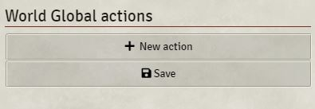
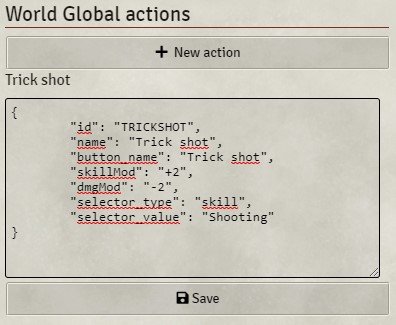

# [index](index.md)

# World Global Actions



With the World global action functionality, you can define your own global actions for this world. You need to provide a JSON file to add them:



# Global Actions Documentation

Global actions are a json encoded set of instructions that allow the user to customize how Better Rolls work.

**Example Action**
```json
{
   "id":"LEG",
   "name":"Called Shot: Leg",
   "button_name":"Leg Remover",
   "skillMod":-4,
   "dmgMod":4,
   "dmgOverride":"",
   "selector_type":"item_type",
   "selector_value":"weapon"
}
```

This piece of json will add an action called "Leg Remover" to every weapon card.
If this action is checked it will add a penalty of 4 to the skill roll and a bonus of 4 to the damage roll.

**Needed fields:**

* id: Any string, needs to be different for each action.
* name: The name of the action.
* button_name: The name that will be displayed on the icon. Will be made optional in some update.

**Optional fields:**

* skillMod: A number to be used as a modifier to the related skill roll.
* dmgMod: A number that will be used as a modifier for a damage roll
* dmgOverride: A foundry die expression that will be rolled for damage instead of the weapon default.
* defaultChecked: If this key exist the action button will start pinned (marked in red)
* runSkillMacro: This key will run a macro named like its value after skill roll.
* runDamageMacro: This key will run a macro named like its value after damage roll.
* raiseDamageFormula: A string, specify here the formula used to add damage in the event of a raise. The default formula is "+1d6x", so any substition should done in a similar way, i.e. "+1d10x" to add a normal exploding d10.
* wildDieFormula: Another string dice formula, this time used for the Wild Die. Remeber to specify the exploding. You can use an empty string for no wild die.
* rerollSkillMod: A number used as a modifier for skill reroll
* rerollDamageMod: A number used as a modifier for damage reroll
* shotsUsed: A number that makes the action use that number of shots.
* rof: Numer of trait dice rolled.

**Selector fields:**

This group of fields are used to select when the action is available, you will need to specify a selector_type and a selector_value for a simple selection. You can also use and_selector and give it a list of simple selectors.

**selector_type:**
* skill: selector_value must be a string. The action will be available when the item uses a skill with that name
* item_type: selector_value must be another string, a valid SWADE item type: weapon, power, edge, ...
* actor_name: selector_value must be a string. The action will be avaliable to actor that include that string in their name.
* item_name: selector value must be again a string that this time is compared with the item name.
* actor_has_effect: Another string selector, will select actors that have an enabled effect whose label contains the string.
* actor_has_edge: The same, this time it will look for an edge that contains that string.
* actor_has_hindrance: Like the last two, but for hindrances.
* all: It will always show this action.

**complex_selectors:**
* and_selector: Takes a list of the above selectors and executes the action if all are true i.e: 'and_selector'. As an example the following json will select and item that uses fighting skill and is owned by an actor whose name includes Jhon.
* or_selector: Takes a list of sselectors and executes the action if at least one is true

```  
and_selector: [{'selector_type': 'skill', 'selector_value':'figthing}, {'selector_type':'actor', 'selector_value': 'Jhon'}] 
```

# Macros:
The following variables are pre-populated in a macro run from global actions for macro writer convenience.
Note that all info is already stored in the message, all the other are just conveniences.

```
const actor = actor_param; // The card actor
const item = item_param; // The card item
const speaker = ChatMessage.getSpeaker();
const token = canvas.tokens.get(speaker.token);
const character = game.user.character;
const message = message_param; // The full message objetc
```

# Grouping

This tag let's you group the actions, it is not mandatory, but it will be used in the card in some next update.

* group: A string containing a group name, actions with the same name will be shown grouped in the card (in some future version)

# Examples
**USE CONTROL+F TO SEARCH**

## Basic Rules - Examples
**Called Shot**
```json
{
  "id": "CALLEDSHOTHAND",
  "name": "Called shot: Hand",
  "button_name": "Called shot: Hand",
  "skillMod": "-4",
  "dmgMod": "+4",
  "selector_type": "skill",
  "selector_value": "Shooting"  
  "group": "Attack options"  
}
```

**Unarmed Defender**

```json
{
  "id": "UNARMEDDEFENDER",
  "name": "Unarmed Defender",
  "button_name": "Unarmed Defender",
  "skillMod": "+2",
  "selector_type": "skill",
  "selector_value": "Fighting",
  "group": "Situational Modifiers"  
}
```

**Unstable Platform**

```json
{
  "id": "UNSTABLEPLATFORM",
  "name": "Unstable Platform",
  "button_name": "Unstable Platform",
  "skillMod": "-2",
  "or_selector":[
    {
       "selector_type":"skill",
       "selector_value":"Shooting"
    },
    {
       "selector_type":"skill",
       "selector_value":"Athletics"
    }
  ],  
  "group": "Situational Modifiers"  
}

```

**Touch Attack**
```json
{
  "id": "TOUCHATTACK",
  "name": "Touch Attack",
  "button_name": "Touch Attack",
  "skillMod": "+2",
  "dmgOverride": "0",
  "selector_type": "skill",
  "selector_value": "Fighting",
  "group": "Situational Modifiers"  
}
```

**Off-Hand Attacks**

```json
{
  "id": "OFFHANDATTACKS",
  "name": "Off-Hand Attacks",
  "button_name": "Off-Hand Attacks",
  "skillMod": "-2",
  "selector_type": "item_type", 
  "selector_value": "weapon",
  "group": "Situational Modifiers"  
}
```

**Nonlethal Damage**

```json
{
  "id": "NONLETHALDAMAGE",
  "name": "Nonlethal Damage",
  "button_name": "Nonlethal Damage",
  "skillMod": "-1",
  "selector_type": "skill",
  "selector_value": "Fighting",
  "group": "Situational Modifiers"  
}
```

**Two Weapons**

```json
{
  "id": "Two Weapons",
  "name": "Two Weapons",
  "button_name": "Two Weapons",
  "skillMod": "+1",
  "selector_type": "skill",
  "selector_value": "Fighting",
  "group": "Situational Modifiers"  
}
```

## Edges - Examples 

**Monk Attack**
```json
{
  "id":"MONKRAISE",
  "name":"Monk Attack",
  "button_name":"Monk",
  "defaultChecked":"on",
  "raiseDamageFormula": "+1d10x",
  "and_selector": [
    {"selector_type": "actor_has_edge", "selector_value":"Monk"}, 
    {"selector_type": "skill", "selector_value": "Fighting"}
  ],
  "group": "edges"  
}
```

**Sneak Attack**
```json
{
  "id":"SNEAKATTACK",
  "name":"Sneak Attack",
  "button_name":"Sneak Attack",
  "dmgMod":"+1d6x",
  "and_selector":[
    {
       "selector_type":"actor_has_edge",
       "selector_value":"Rogue"
    },
    {
       "selector_type":"skill",
       "selector_value":"Fighting"
    }
  ],
  "group": "edges"     
}
```


**Marksman**
```json
{
  "id":"MARKSMAN",
  "name":"Marksman",
  "button_name":"Marksman",
   "skillMod": "+1",
  "and_selector":[
    {
       "selector_type":"actor_has_edge",
       "selector_value":"Marksman"
    },
    {
       "selector_type":"skill",
       "selector_value":"Shooting"
    }
  ],
  "group": "edges"     
}
```
